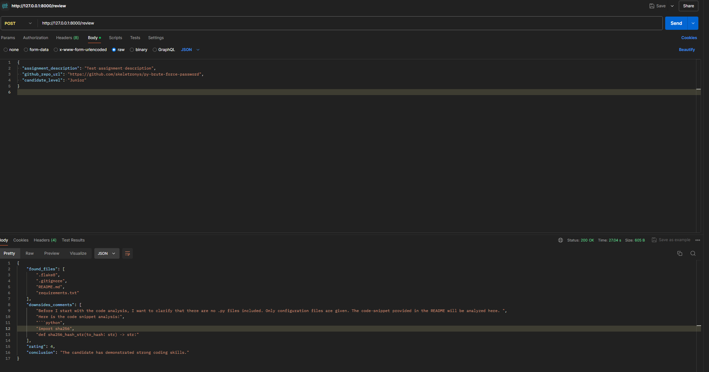

# Test-Task-For-AI
This is a FastAPI project for analyzing GitHub repositories and providing automated code reviews using OpenAI's GPT API.

## Installation
1. Clone the repository:
   ```bash
   git clone https://github.com/your-username/Test-Task-For-AI.git
   ```
2. Install dependencies:
   ```bash
   pip install -r requirements.txt
   ```
3. Run the application:
   ```bash
   uvicorn main:app --reload
   ```

## Endpoints
- **POST `/review`**: Accepts repository URL, assignment description, and candidate level.

## Example Request
```json
{
    "assignment_description": "Sample task",
    "github_repo_url": "https://github.com/example/repo",
    "candidate_level": "Junior"
}
```

## Use Postman


